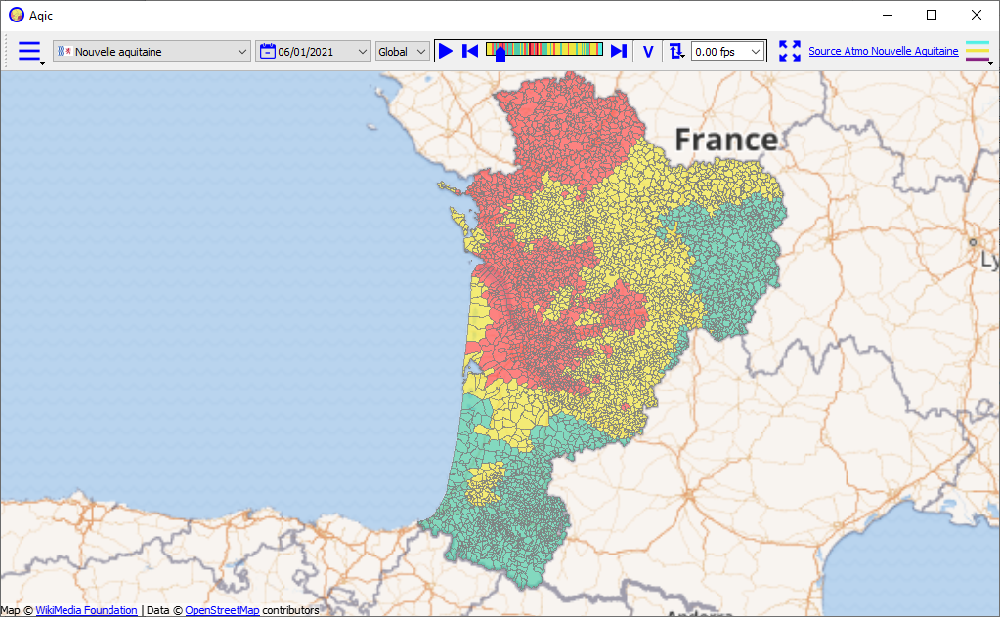

** Aqic ** is a tool allowing the representation of air quality in France.
Although Aqic is available in English and French, the data comes from “open data” sites which are only French.
It is for this reason that the rest of this file is French. 

**Aqic** est un outil permettant la représentation de l'indice qualité de l'air en France.
Cet outil utilise les données publiques publiées par les AASQA.
Suivant les directives d'ATMO France, l'indice qualité de l'air est défini comme un état de la qualité de l'air sur une journée.
Cet indice est réparti sur 6 niveaux définis par un qualificatif (Bon, Moyen, Dégradé, Mauvais, Très mauvais, Extrêmement mauvais)
et représenté par une couleur pour chaque qualificatif. L'indice est défini soit au niveau de la commune soit au niveau de l'EPCI.
Toutes les informations essentielles sont accessibles à https://atmo-france.org/.

Aqic met à disposition plusieurs grandes fonctions:
- Afficher sur la carte la commune avec une couleur représentant l'indice qualité de l'air pour une région et pour une date donnée.
- Choisir une date.
- Choisir quel indice représenter (global ou sous-indice).
- Faite varier la date en continue.
- Consulter la qualité de l'air pour une commune.
- Exporter la représentation sous forme d'image pour créer des rapports ou une vidéo.

**Notes de développement**
1. Aqic est codé en C++ et utilise le framework Qt5.15.2 disponible à https://www.qt.io/.
2. Compilateurs
  - Windows. Mingw81_64 et Msvc2015_64. Les installeurs utilisent Mingw81_64.
  - Linux. GCC 9.3.0.
  - MacOS. La chaîne d'outils LLMV 10.0.1 with Clang 1001-0-46-4.
3. Les bibliothèques
   Trois bibliothèques statiques sont définies. Aqic n'utilise pas toutes les fonctions définies dans ces bibliothèques. Certaines sont réservées
   pour un usage future.
   - tools définie les fonctions générales ne dépendants pas de Qt.
   - qtools définie les fonctions générales qui dépendent de Qt.
   - wtools definie les widgets généraux utilisés par Aqic.
   - town definie les conteneurs qualité de l'air et communes.
   
**Installeurs**
Pour ne pas avoir à reconstruire Aqic à partir des sources, les binaires permettants l'installation sous Windows 10, 
Linux base Debain, Linux base Redhat, MacOS sont disponibles à https://drive.google.com/drive/folders/1RIwopzqaENIYevMgqaycLz1McplQV9ox?usp=sharing.
Ce dossier contient également la documentation ainsi que le journal des évolutions.
Bien entendu, ces binaires sont issus de la version stable et peuvent ne pas correspondre à la branche en cours de développement.

**Contact**
Vous pouvez me contacter directement à **aivctrl@yahoo.com**
  

 

